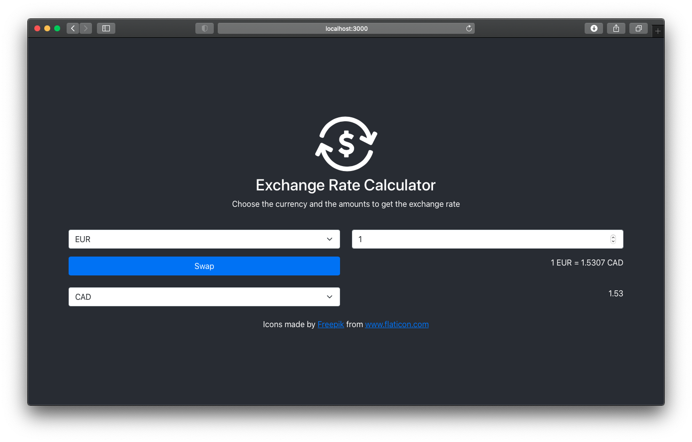

# Exchange Rate Calculator

## Introduction

The aim of this project is to develop a little exchange rate calculator web application for PEC 1 of the subject **Front-end development with JavaScript frameworks** of the UOC Master's Degree in Application Development for Mobile Devices. In our case that framework has been [React JS](https://https://es.reactjs.org).

## The Application

The web app is quite simple. You only have one input source and when you edit the amount or currency, the app calculates the result. The 'Swap' button allows to exchange the currency quickly.

## Resources

- [Bootstrap](https://getbootstrap.com)
- [Circular Progress of Material UI](https://material-ui.com/api/circular-progress/)
- [React Alert Package](https://www.npmjs.com/package/react-alert)
